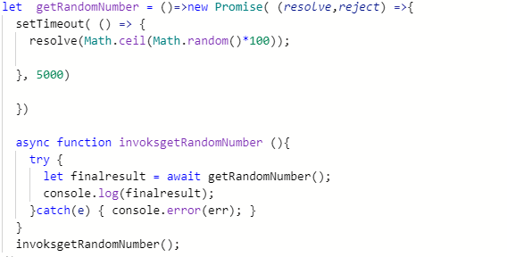

# Array.map()

* The `.map()` method creates a new array populated with the results of calling a provided function on every element in the calling array.

* `.map()` calls a provided callback function once for each element in an array, in order, and constructs a new array from the results.
* `.map()` does not change the original array.
### Syntax 
* `array.map(function(currentValue, index, arr), thisValue)`
### Example :

*****************************************************************

# Array.reduce()

* The `reduce()`  method executes a reducer function (that you provide) on each element of the array, resulting in a single output value **(from left-to-right)**.
* The return value of the function is stored in an accumulator **(result/total)**.
* The `reduce()` method does not change the original array.
### Syntax 
* `array.reduce(function(total, currentValue, currentIndex, arr), initialValue)`

* The reducer function takes four arguments:
   - Accumulator
   - Current Value
   - Current Index
   - Source Array

* Your reducer function's returned value is assigned to the **accumulator**, whose value is remembered across each iteration throughout the array, and ultimately becomes the final, single resulting value.

### Example :

# superagent() With normal Promise .then() syntax: 

    function getMovies(req , res){
    const city = req.query.search_query;
    const url = `https://api.themoviedb.org/3/movie/top_rated` //?city=${city}&key=${PARKS_API_KEY}`;
    const quryParams = {
        query :city,
        api_key:MOVIE_API_KEY,

    };
    // console.log(quryParams);
    superagent.get(url , quryParams).then(dataFromAPI=>{
    const movies = dataFromAPI.body.results.map(data => new Movies (data));
    res.send(movies);})

# superagent() with async / await syntax :

# promises 

* when i said :

     ~~~~ 
     "I Promise a Result!"

     "Producing code" is code that can take some time.

     "Consuming code" is code that must wait for the result.

     - A Promise is a JavaScript object that links producing code and consuming code.

* The Promise object represents the eventual completion (or failure) of an asynchronous operation and its resulting value.
* A JavaScript Promise object contains both the producing code and calls to the consuming code:
  ~~~~
  let myPromise = new Promise(function(myResolve, myReject) {
   // "Producing Code" (May take some time)

  myResolve(); // when successful
  myReject();  // when error
   });

   // "Consuming Code" (Must wait for a fulfilled Promise)
   myPromise.then(
  function(value) { /* code if successful */ },
  function(error) { /* code if some error */ }
  );

* When the executing code obtains the result, it should call one of the two callbacks:
   - Success = myResolve(result value)
   - Error = myReject(error object)

* A JavaScript Promise object can be:
   - Pending
   - Fulfilled
   - Rejected
   
* The Promise object supports two properties: **state** and **result**.

* While a Promise object is **"pending"** (working), the result is *undefined*.

When a Promise object is **"fulfilled"**, the result is a *value*.

When a Promise object is **"rejected"**, the result is an *error object*.
## Example :

# Are all callback functions considered to be Asynchronous? 
* a **callback** doesn't make a function **asynchronous**. 
* There are many examples of functions that take a function argument but are not asynchronous.
* For example there's `forEach` in Array. It iterates over each item and calls the function once per item. 
 
*****************************************************************

## [ Home ](https://reem-alqurm.github.io/ReadingNotes/)