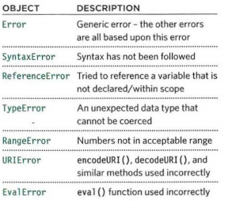

# Error Handling & Debugging

* JavaScript can be hard to learn and everyone makes mistakes when writing it.

* To find the source of an error, it helps to know how scripts are processed. 

* Debugging is the process of finding errors. It involves a process of deduction. 

##  EXECUTION CONTEXT : Every statement in a script lives in one of three execution contexts:
  - GLOBAL CONTEXT : Code that is in the script, but not in a function , There is only one global context in any page.
  - FUNCTION CONTEXT : Code that is being run within a function, Each function has its own function context.
  - EVAL CONTEXT (NOT SHOWN): Text is executed like code in an internal function called eva.

## VARIABLE SCOPE : The first two execution contexts correspond with the notion of scope :
  - GLOBAL SCOPE: If a variable is declared outside a function, it can be used anywhere because it has global scope.
  - FUNCTION-LEVEL SCOPE: When a variable is declared within a function, it can only be used within that function. 

## EXECUTION CONTEXT & HOISTING 
 * Each time a script enters a new execution context, there are two phases of activity:
 - PREPARE:
   * The new scope is created.
   * Variables, functions, and arguments are created.
   * The value of the this keyword is determined.
-  EXECUTE:
  * Now it can assign values to variables.
  * Reference functions and run their code.
  * Execute statements.

* If a JavaScript statement generates an error, then it throws an exception , the interpreter stops and looks for exception-handl ing code. 

* The console helps narrow down the area in which the error is located, so you can try to find the exact error. 
* There are seven types of built-in error objects in JavaScript :

* If you know that you may get an error, you can handle it gracefully using the `try`, `catch`, `finally` statements.

*****************************************************************

## [ Home ](https://reem-alqurm.github.io/ReadingNotes/)
