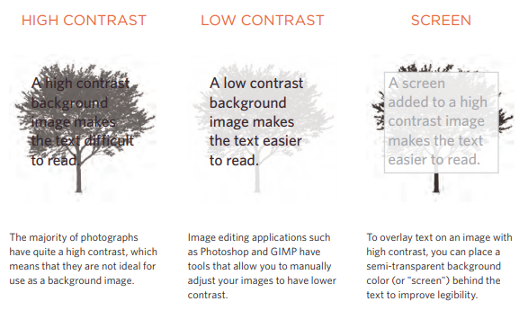

# Images

* You can control the size of an image using the ``width` and `height` properties in CSS, just
like you can for any other box.

* Specifying image sizes helps pages to load more smoothly because the HTML and CSS
code will often load before the images, and telling the browserhow much space to leave for an
image .

* The `background-image` property allows you to place an image behind any HTML element. 

* The `background-repeat` property can have four values :
 - `repeat` : The background image is repeated both horizontally and vertically .
 - `repeat-x` : The image is repeated horizontally only .
 - `repeat-y` : The image is repeated vertically only.
 - `no-repeat`: The image is only shown once.

 * If you want to overlay text on a background image, the image must be low
contrast in order for the text to be legible.

# Search Engine Optimization (SEO)

* Is the practice of trying to help your site appear nearer the top of search engine results
when people look for the topics that your website covers.

* SEO is often split into two areas :

  - on-page techniques: On-page techniques are the methods you can use on your
    web pages to improve their rating in search engines.

  -  off-page techniques: Search engines help determine how to rank your
    site by looking at the number of other sites that link to yours.

* Analytics tools such as Google Analytics allow you to see how many people visit your site, how they find it,
and what they do when they get there.

* To put your site on the web, you will need to obtain a domain name and web hosting.

* FTP programs allow you to transfer files from your local computer to your web server.

* Many companies provide platforms for blogging, email newsletters, e-commerce and other popular website
tools .

# Video and Audio

* HTML5 comes with elements for embedding rich media in documents `<video>` and `<audio>` for controlling playback, seeking, etc. 

* The `<video>` and `<audio>` elements allow you to embed video and audio into web pages.

* the `HTMLMediaElement` API provides features to allow you to control video and audio players programmatically — for example `HTMLMediaElement.play()`, `HTMLMediaElement.pause()`, This interface is available to both `<audio>` and `<video>` elements, as the features you'll want to implement are nearly identical. 

# Flash

*  Flash has been a very popular tool for creating animations, and later
for playing audio and video in websites.

* Flash is not supported on iPhone or iPad.

*****************************************************************

## [ Home ](https://reem-alqurm.github.io/ReadingNotes/)
