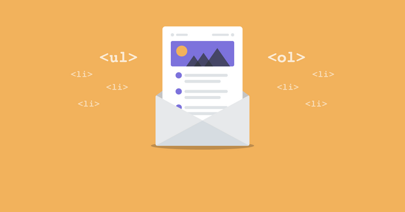
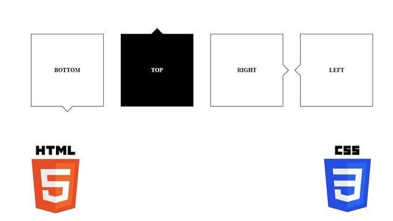

# Lists 

## Lists are used to group together related pieces of information so they are clearly associated with each other and easy to read. In modern web development, lists are workhorse elements, frequently used for navigation as well as general content.

 ## Lists are good from a structural point of view as they help create a well-structured, more accessible, easy-to-maintain document. They are also useful because they provide specialized elements to which you can attach CSS styles. Finally, semantically correct lists help visitors read your web site, and they simplify maintenance when your pages need to be updated.

## More About Lists 
 - There are three types of HTML lists: ordered,unordered and definition.
 - Ordered lists use numbers.
 - Unordered lists use bullets.
 - Definition lists are used to define terminology.
 - Lists can be nested inside one another.

# Boxes 

## Part Of Box:
 - Content : The content of the box, where text and images appear
 - Padding : Clears an area around the content. The padding is transparent
 - Border : A border that goes around the padding and content
 - Margin : Clears an area outside the border. The margin is transparent

## More About Box 
 - CSS treats each HTML element as if it has its own box.
 - You can use CSS to control the dimensions of a box.
 - You can also control the borders, margin and padding for each box with CSS.
 - It is possible to hide elements using the display and visibility properties.
 - Block-level boxes can be made into inline boxes, and inline boxes made into block-level boxes.
 - Legibility can be improved by controlling the width of boxes containing text and the leading.
 - CSS3 has introduced the ability to create image borders and rounded borders.

*****************************************************************

## [ Home ](https://reem-alqurm.github.io/ReadingNotes/)
