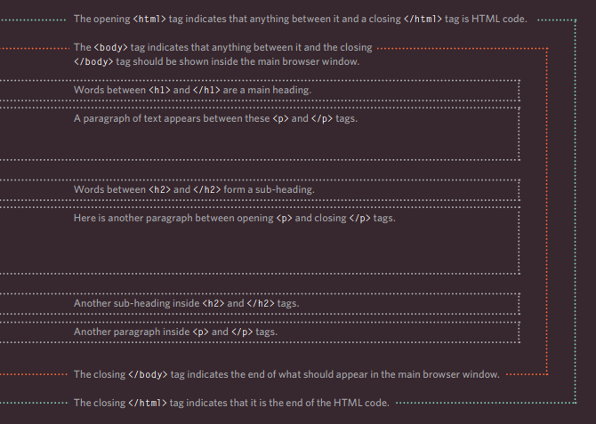
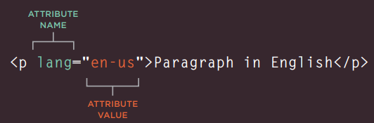

# HTML & JavaScript 

## HTML

### The Structure :
* HTML uses elements to describe the structure of pages, each
element has an opening tag and a closing tag.
* Tags act like containers. They tell you something about the information that lies between their opening and closing tags.

* Attributes provide additional information about the contents of an element. They appear on the opening tag of the element and are
made up of two parts: a name and a value, separated by an equals sign.

* To learn HTML you need to know what tags are available for you to use, what they do, and where they can go.
* when we write DOCTYPES it tells the browsers which version of HTML you
are using.

* we can add comments to the code between the `<!-- and -->` markers.

* The id and class attributes allow you to identify particular elements.

* The `
` and `` elements allow us to group block-level and 
inline elements together.

* `<iframes>` cut windows into the web pages through which other pages can be displayed.
* The `<meta>` tag to supply all kinds of information about your web page.
* Escape characters are used to include special characters in your pages such as `<, >,` and `©`.
* There is a new HTML5 elements indicate the purpose of different parts of a web page and help to describe its structure better.
* The new elements provide clearer code (compared with multiple `
` elements).
* Site maps allow you to plan the structure of a site.

* Wireframes allow you to organize the information that will need to go on each page.

* Visual hierarchy helps visitors understand what you are trying to tell them.

## JavaScript 

* first of all script is a series of instructions that a computer can follow to achieve a goal.

* To write a script, you need to first state your goal and then list the
tasks that need to be completed in order to achieve it.

* Steps tp write a script :
- DEFINE THE GOAL : First, you need to define the task you want to achieve. You can think of this as a puzzle for the computer to solve.

- DESIGN THE SCRIPT : To design a script you split the goal out into a series of tasks that are going to be involved in solving this puzzl using a flowchart.

- CODE EACH STEP : Each of the steps needs to be written in a programming language that the computer understands. In our case, this is JavaScript.
 

*****************************************************************

## [ Home ](https://reem-alqurm.github.io/ReadingNotes/)
