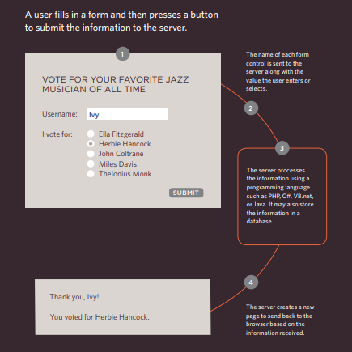
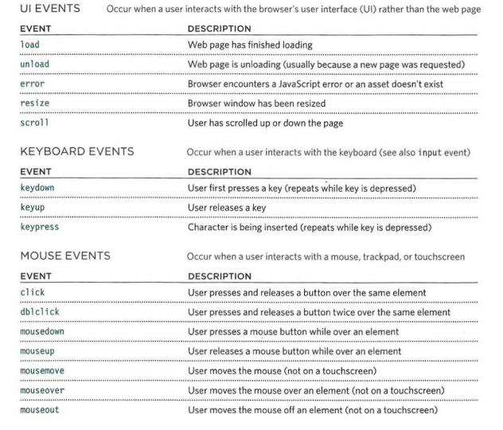

# Form

* Traditionally, the term 'form' has referred to a printed document that contains
spaces for you to fill in information.

* HTML borrows the concept of a form to refer to different elements that allow you to collect information from visitors to your site.

* There are several types of form controls that you can use to collect information from visitors
to your site :

 - ADDING TEXT:Used for a single line of text such as email addresses and names.

 - Making Choices: such as Radio buttons ,Checkboxes ,Drop-down boxes.

 - Submitting Forms: such as Submit buttons ,Image buttons.

 - Uploading Files:Allows users to upload files (e.g. images) to a website

## How Forms Work:

## Form Structure
* Form controls live inside a `<form>` element. This element should always carry the action
attribute and will usually have a method and id attribute too.
* the action Its value is the URL for the page on the server that will receive the
information in the form when it is submitted.
* the method Forms can be sent using one of two methods: get or post.
* The `<input>` element is used to create several different form controls.
* The value of the `type` attribute determines what kind of input they will be creating. 
`type="text"`When the type attribute has a value of text, it creates a singleline text input.
* `name` When users enter information into a form, the server needs to know which form control each 
piece of data was entered into.

* HTML5 introduces new form elements which make it easier for visitors to fill in forms.

# Lists 

## Lists are used to group together related pieces of information so they are clearly associated with each other and easy to read. In modern web development, lists are workhorse elements, frequently used for navigation as well as general content.

 ## Lists are good from a structural point of view as they help create a well-structured, more accessible, easy-to-maintain document. They are also useful because they provide specialized elements to which you can attach CSS styles. Finally, semantically correct lists help visitors read your web site, and they simplify maintenance when your pages need to be updated.

## More About Lists 
 - There are three types of HTML lists: ordered,unordered and definition.
 - Ordered lists use numbers.
 - Unordered lists use bullets.
 - Definition lists are used to define terminology.
 - Lists can be nested inside one another.

# Tables 

* A table represents information in a grid format. 

* The `< table>` element is used to add tables to a web page.
* A table contans a set of colomns and rows 
* `<tr>` used to create new row `<td>` used to fill the data in. 
* `<th>` used to make header .

# Events 

* When you browse the web, your browser registers different types of events.
 It's the browser's way of saying, "Hey, this just happened." Your script can then respond to these events.

* Here is a selection of the events that occur in the browser while you are browsing the web.
 Any of these events can be used to trigger a function in your JavaScript code. 
 
 

*****************************************************************

## [ Home ](https://reem-alqurm.github.io/ReadingNotes/)
