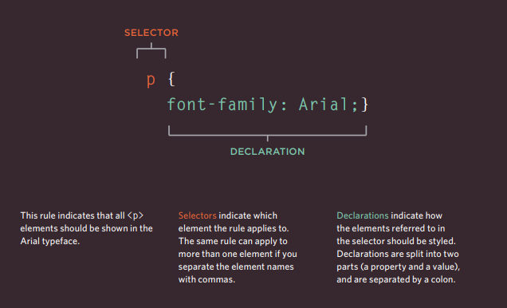

## Css & Colors

* CSS allows you to create rules that specify how the content of an element should appear. For example, you can specify that the background of the page is cream, all paragraphs should appear in gray using the Arial typeface, or that all level one headings should be in a blue, italic, Times typeface.
* The key to understanding how CSS works is to imagine that there is an invisible box around
every HTML element.
* Using CSS, you could add a border around any of the boxes, specify its width and height, or add a background color. You
could also control text inside a box — for example, its color, size, and the typeface used.
* CSS works by associating rules with HTML elements. These rules govern how the content of specified elements should be displayed. A CSS rule contains two parts: a selector and a declaration.

### BLOCK & INLINE ELEMENTS :
* Block level elements : look like they start on a new line.Examples include the h1-h6, p and div elements.
* Inline elements :  flow within the text and do not start on a new line. Examples include b, i, img, em and span.

* CSS declarations sit inside curly brackets and each is made up of two parts: a property and a value, separated by a colon. You can specify several properties in one declaration, each separated by a semi-colon.

* CSS rules usually appear in a separate document, although they may appear within an HTML page.

## Color :
#### Color not only brings your site to life, but also helps convey the mood and evokes reactions
 The color property allows you to specify the color of text inside an element.
 You can specify any color in CSS in one of three ways:
 * rgb values : These express colors in terms of how much red, green and blue are used to make it up.
 For example: rgb(100,100,90).
* hex codes : These are six-digit codes that represent the amount of red, green and blue in a color,
preceded by a pound or hash #sign. For example: #ee3e80.
* color names : There are 147 predefined color names that are recognized
by browsers. For example: DarkCyan.

#### * Color pickers can help you find the color you want.

#### * It is important to ensure that there is enough contrast between any text and the background color (otherwise people will not be able to read your content).

#### * CSS3 has introduced an extra value for RGB colors to indicate opacity. It is known as RGBA.

#### * CSS3 also allows you to specify colors as HSL values, with an optional opacity value. It is known as HSLA.

*****************************************************************

## [ Home ](https://reemalqurm.github.io/reading-notes/)
